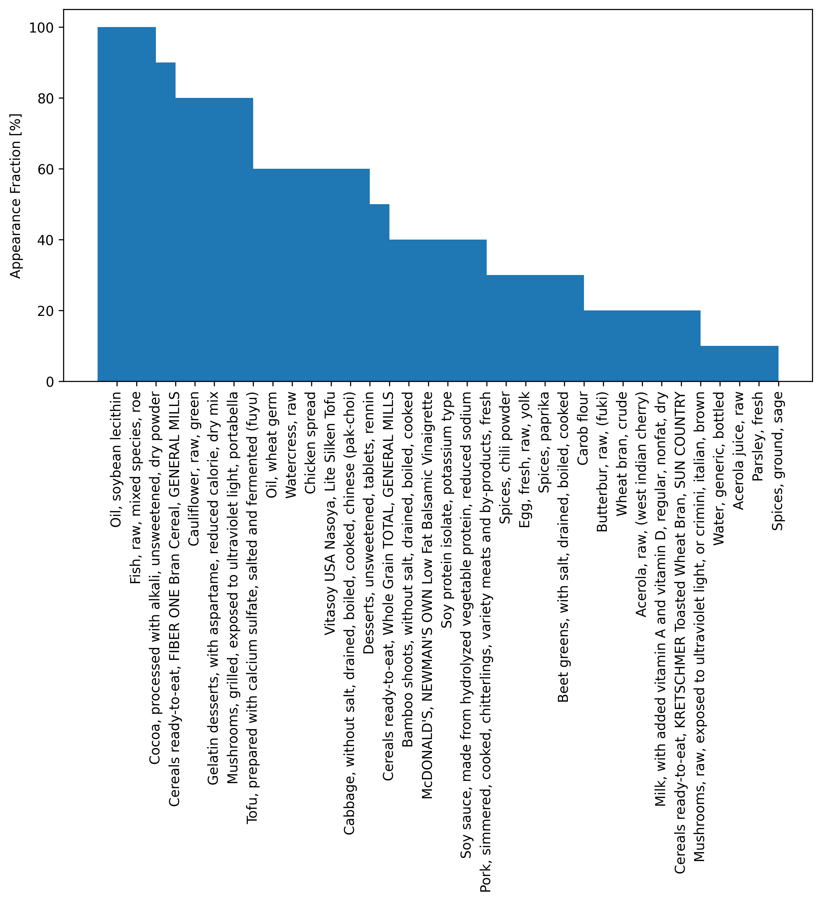
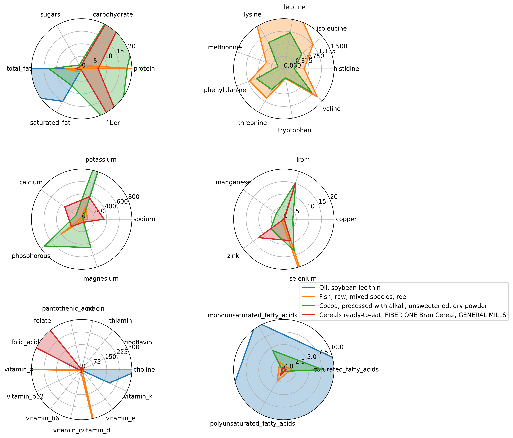

# Nut-Opt
Linear programming library for nutrition optimization.
---
Backend for [my blog post on finding the optimal diet and identifying superfoods](https://www.alpeirson.com/blog/nutrition). Solves the following LP for a range of tradeoff parameters and plots the results:

Minimize $c^T\mathbf{x} + \gamma\mathcal{1}^T\mathbf{x}$

subject to $l \leq A\mathbf{x} \leq u$, $\mathbf{x} \geq 0$

where $c$ is the vector of calories per 100g, the ones vector $\mathcal{1}$ is the vector of weights in units of 100g, $\mathbf{x}$ is the vector of weights of each food in units of 100g, and $\gamma$ is the tradeoff variable. The constraints $l$ and $u$ are the lower and upper bounds on the nutrient features, respectively. The matrix $A$ is the matrix of constrained nutrients per 100g of each food.

## Usage
```python main.py -f <food_list> --n_sweep <n> --n_plot <n>```

`-f` is a comma-separated list of foods to include in the optimization. If not specified, all foods are included.

`--n_sweep` is the number of tradeoff parameters $\gamma$ to sweep over.

`--n_plot` is the number of superfoods to radar plot.

## Data
The nutritional dataset in `data/` is from [kaggle](https://www.kaggle.com/datasets/trolukovich/nutritional-values-for-common-foods-and-products), originally sourced [here](https://www.nutritionvalue.org/).

## Constraints
These are editable in `nutopt/definitions.py`. The default constraints are:

#### Macros
50 < total_fat (g) < 120

10 < saturated_fat (g) < 25

70 < protein (g) < 100

130 < carbohydrate (g) < 400

#### Vitamins
550 < choline (mg) < 2500

400 < folate (mcg) < 900

400 < folic_acid (mcg) < 900

16 < niacin (mg) < 30

5 < pantothenic_acid (mg) < 100

1.3 < riboflavin (mg) < 500

1.2 < thiamin (mg) < 200

3000 < vitamin_a (IU) < 8000

2.4 < vitamin_b12 (mcg) < 8

1.3 < vitamin_b6 (mg) < 4

90 < vitamin_c (mg) < 1000

600 < vitamin_d (IU) < 5000

15 < vitamin_e (mg) < 500

120 < vitamin_k (mcg) < 500
#### Minerals
1500 < sodium (mg) < 3000

1300 < calcium (mg) < 2000

0.9 < copper (mg) < 7

8 < iron (mg) < 35

400 < magnesium (mg) < 500

2.3 < manganese (mg) < 7

700 < phosphorous (mg) < 3500

4700 < potassium (mg) < 7000

55 < selenium (mcg) < 300

11 < zinc (mg) < 35

#### Amino Acids
0.287 < cystine (g) < inf

0.7 < histidine (g) < inf

1.4 < isoleucine (g) < inf

2.73 < leucine (g) < inf

2.1 < lysine (g) < inf

0.728 < methionine (g) < inf

0.875 < phenylalanine (g) < inf

1.05 < threonine (g) < inf

0.28 < tryptophan (g) < inf

0.875 < tyrosine (g) < inf

1.82 < valine (g) < inf

#### Carbohydrates
38 < fiber (g) < 55

0 < sugars (g) < 40

#### Fatty Acids
17 < polyunsaturated_fatty_acids (g) < 30

#### Other
50 < cholesterol (mg) < 250

0 < alcohol (g) < 5

100 < water (g) < 2000

## Results
For all foods in the dataset and all default constraints active. The optimal tradeoff curve between calories and weight is shown below. 


And here is the optimal diet for $\gamma = 1$ with weight in units of 100g:

Total calories:  871.1281429945614 kcal
Total weight:  1113.0965300000835 g

#### Weight (100g)     Name

4.412183          Cauliflower, raw, green

1.453970          Watercress, raw

0.787405          Bamboo shoots, without salt, drained, boiled, cooked

0.657726          Chicken spread

0.588269          Cocoa, processed with alkali, unsweetened, dry powder

0.569966          Fish, raw, mixed species, roe

0.518734          Mushrooms, grilled, exposed to ultraviolet light, portabella

0.516959          Tofu, prepared with calcium sulfate, salted and fermented (fuyu)

0.506891          Cabbage, without salt, drained, boiled, cooked, chinese (pak-choi)

0.361921          Cereals ready-to-eat, FIBER ONE Bran Cereal, GENERAL MILLS

0.292224          Gelatin desserts, with aspartame, reduced calorie, dry mix

0.147996          Oil, soybean lecithin'

0.146714          Vitasoy USA Nasoya, Lite Silken Tofu

0.095675          Yeast extract spread

0.048087          Oil, wheat germ

0.023411          Mushrooms, raw, exposed to ultraviolet light, or crimini, italian, brown

0.002834          Desserts, unsweetened, tablets, rennin


### Superfoods
Count of how many times foods appear in optimal diets.



Nutritional characteristics of the top four superfoods.

